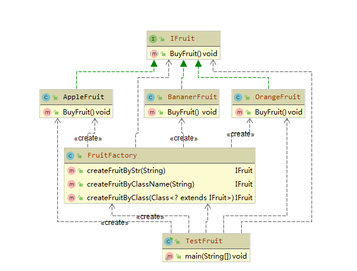
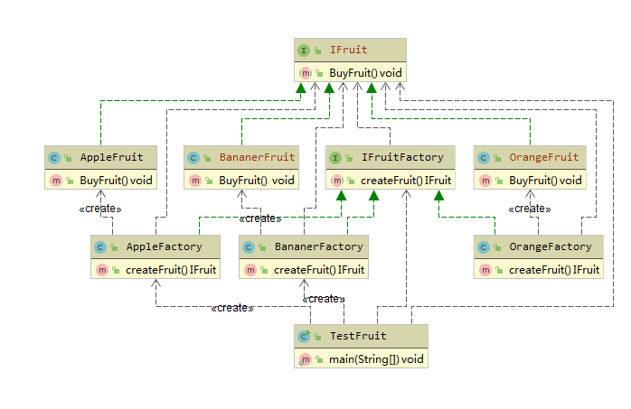
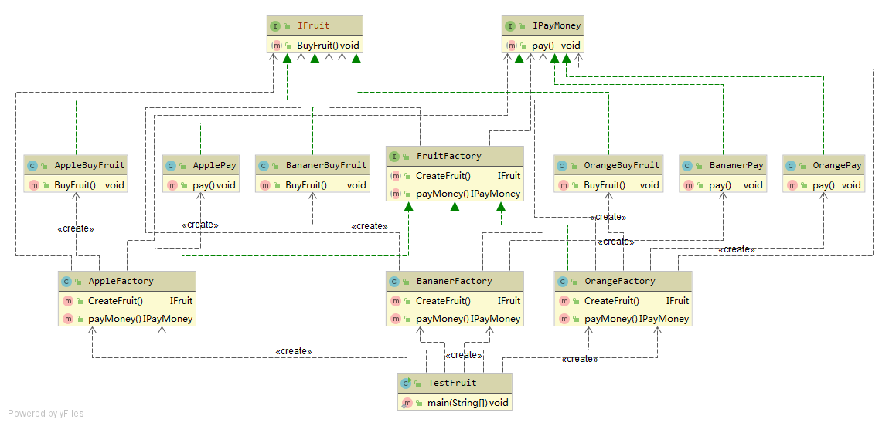

# DesignPattern
设计模式

- 工厂模式
    -
- 简单工厂模式
- 简单工厂模式（Simple Factory Pattern）是指由一个工厂对象决定创建出哪一种产品类
的实例，但它不属于GOF，23 种设计模式（参考资料：
http://en.wikipedia.org/wiki/Design_Patterns#Patterns_by_Type）。简单工厂适用
于工厂类负责创建的对象较少的场景，且客户端只需要传入工厂类的参数，对于如何创
建对象的逻辑不需要关心。

- 工厂方法模式
- 工厂方法模式（Fatory Method Pattern）是指定义一个创建对象的接口，但让实现这个
接口的类来决定实例化哪个类，工厂方法让类的实例化推迟到子类中进行。在工厂方法
模式中用户只需要关心所需产品对应的工厂，无须关心创建细节，而且加入新的产品符
合开闭原则。
- 
- 
- 抽象工厂模式
- 抽象工厂模式（Abastract Factory Pattern）是指提供一个创建一系列相关或相互依赖
对象的接口，无须指定他们具体的类。客户端（应用层）不依赖于产品类实例如何被创
建、实现等细节，强调的是一系列相关的产品对象（属于同一产品族）一起使用创建对
象需要大量重复的代码。需要提供一个产品类的库，所有的产品以同样的接口出现，从
而使客户端不依赖于具体实现。
- 

