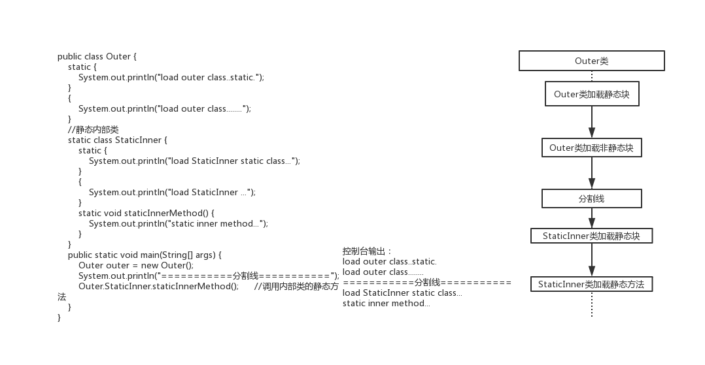

# **单例模式**
- 概念：单例模式是指确保一个类在任何情况下都绝对只有一个实例，并提供一个全局访问点。隐藏其所有的构造方法，属于创造性模式。
- 优点：在内存中只有一个实例，减少了内存开销。可以避免对资源的多重占用。设置全局访问点，严格控制访问。
- 缺点：没有接口，扩展困难。如果要扩展单例对象，只有修改代码，没有其他途径。
## 1. 饿汉模式
- 优点：没有加任何的锁、执行效率比较高，在用户体验上来说，比懒汉式更好。
- 缺点：类加载的时候就初始化，不管用与不用都占着空间，浪费了内存

## 2. 懒汉模式
- 1、简单单例模式：存在线程安全隐患 需要加上synchronize关键字
- 2、加锁单例模式：在线程数量比较多情况下，如果CPU 分配压力上升，会导致大批量线程出现阻塞，从而导致程序运行性能大幅下降
- 3、双重检查锁单例模式：程序性能还是存在一定影响的，因为采用synchronized双重锁
- 4、静态内部类：这种形式兼顾饿汉式的内存浪费，也兼顾synchronized 性能问题。内部类一定是要在方法调用之前初始化，巧妙地避免了线程安全问题。

## 3. 注册模式
- 注册式单例又称为登记式单例，就是将每一个实例都登记到某一个地方，使用唯一的标
识获取实例。注册式单例有两种写法：一种为容器缓存，一种为枚举登记
- 1、采用ConcurrentHashMap：容器式写法适用于创建实例非常多的情况，便于管理。但是，是非线程安全的
- 2、枚举类型：枚举式单例在静态代码块中就给INSTANCE 进行了赋值，是饿汉式单例的实现。

 
## 4. ThreadLocal模式
- ThreadLocal 不能保证其创建的对象是全局唯一，但是能保证在单个线程中是唯一的，天生的线程安全

## 5. 破坏单例模式的方式
- 1、反射破坏单例
- 通过反射拿到私有的构造方法--> 强制访问，强吻，不愿意也要吻-->暴力初始化
- 防止：构造方法中做一些限制，一旦出现多次重复创建，则直接抛出异常
- 2、序列化破坏单例
- 当我们将一个单例对象创建好，有时候需要将对象序列化然后写入到磁盘，下次使用时
再从磁盘中读取到对象，反序列化转化为内存对象。反序列化后的对象会重新分配内存，
即重新创建。那如果序列化的目标的对象为单例对象，就违背了单例模式的初衷，相当
于破坏了单例 
- 防止：增加readResolve()

## 6. 内部类的执行顺序

 

