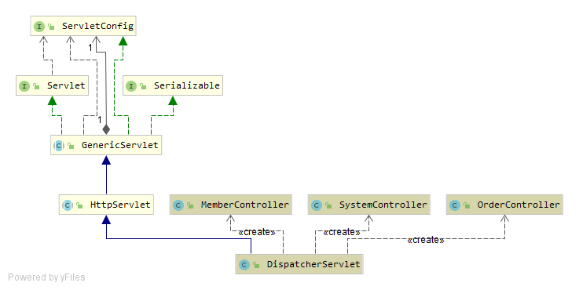

# **委派模式**
## 1. 定义
委派模式（Delegate Pattern）的基本作用就是负责任务的调用和分配任务，跟代理模式很像，可以看做是一种特殊情况下的静态代理的全权代理，但是代理模式注重过程，而委派模式注重结果。
## 2. 适用场景
1、老板给经理分配任务，由经理分给员工任务；

# **策略模式**
## 1. 定义
策略模式（Strategy Pattern）是指定义了算法家族、分别封装起来，让它们之间可以互相替换，此模式让算法的变化不会影响到使用算法的用户。
可以避免多重分支的if...else...和switch语句
## 2. 适用场景
1、假如系统中有很多类，而他们的区别仅仅在于他们的行为不同。
2、一个系统需要动态地在几种算法中选择一种。

## 3.策略模式的优缺点
优点：
1、策略模式符合开闭原则。
2、避免使用多重条件转移语句，如if...else...语句、switch 语句
3、使用策略模式可以提高算法的保密性和安全性。
缺点：
1、客户端必须知道所有的策略，并且自行决定使用哪一个策略类。
2、代码中会产生非常多策略类，增加维护难度。

## 4.问题
1、举例Spring源码中你见过的委派模式，并画出类关系图。

2、利用策略模式重构一段业务代码。
